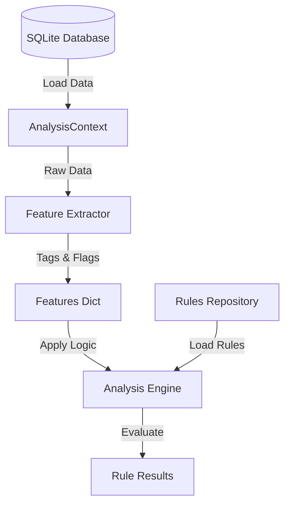

# Архитектура Аналитического Движка (Feature-Based Rule Engine)

Вместо сложной генерации SQL-запросов из Excel, проект использует гибкую архитектуру **Feature-Based Rule Engine**. Этот подход разделяет логику извлечения данных, вычисления признаков (features) и оценки правил.

## Общая Схема



## Компоненты

### 1. Контекст (`AnalysisContext`)
**Файл:** `code/analytics/definitions.py`

Единый объект, содержащий все "сырые" данные для конкретного часа:
*   **Ба Цзы:** Столпы года, месяца, дня, часа.
*   **Ци Мэнь:** Полный расклад (звезды, ворота, духи, стволы) для всех 9 дворцов.
*   **Мета-данные:** Дата, сезон (Solar Term), ID часа.

### 2. Экстрактор Признаков (`Feature Extractor`)
**Файл:** `code/analytics/features.py`

Модуль Python, который превращает сырые данные в понятные бизнес-признаки (теги).
Вместо того чтобы писать в правиле `IF DayBranch='Zi' AND YearBranch='Wu'`, мы вычисляем это здесь один раз.

**Примеры признаков:**
*   `bazi_clash_day_year`: True/False (Столкновение дня и года).
*   `qm_has_green_dragon`: True/False (Есть ли структура "Зеленый Дракон").
*   `season_strength_fire`: "Strong" (Сила элемента Огня в сезоне).

### 3. Репозиторий Правил
**Файл:** `Metodology/rules_repository.yaml`

Замена Excel-файлу. Текстовый файл в формате YAML, содержащий список правил.
Каждое правило ссылается на вычисленные признаки.

**Пример правила:**
```yaml
- id: "green_dragon"
  name: "Зеленый Дракон поворачивает голову"
  score: 100
  condition: "features.get('qm_has_green_dragon')"
  category: "structure"
```

### 4. Движок (`AnalysisEngine`)
**Файл:** `code/analytics/engine.py`

Класс, который:
1.  Загружает данные из БД.
2.  Запускает Экстракторы.
3.  Проходит по списку правил YAML и проверяет условие `condition` для каждого.
4.  Возвращает список сработавших правил и итоговый балл.

## Процесс добавления нового правила

1.  **Определите логику**: Например, "День Янского Дерева (Jia) и Врата Жизни (Life) — это хорошо".
2.  **Добавьте признак в `code/analytics/features.py`**:
    ```python
    # В функции extract_qimen_features
    # Проверяем, есть ли Jia + Life в любом дворце
    has_jia_life = False
    for p in ctx.qimen.palaces.values():
        if ctx.bazi.day_stem == '甲' and p.gate == '生':
            has_jia_life = True
            break
    ctx.features['is_jia_life_gate'] = has_jia_life
    ```
3.  **Добавьте правило в `Metodology/rules_repository.yaml`**:
    ```yaml
    - id: "jia_life_good"
      name: "Дерево Ян и Врата Жизни"
      score: 50
      condition: "features.get('is_jia_life_gate')"
      description: "Благоприятно для здоровья и роста."
    ```

## Преимущества

1.  **Читаемость**: Правила в YAML понятны даже не программисту.
2.  **Производительность**: Тяжелая логика выполняется в Python, а не в базе данных. Признаки можно кэшировать.
3.  **Тестируемость**: Логику `features.py` можно тестировать юнит-тестами без подключения к БД.
4.  **Гибкость**: Можно легко добавлять сложные условия (например, фазы Ци, символические звезды), просто расширяя Python-код, не меняя структуру БД.
