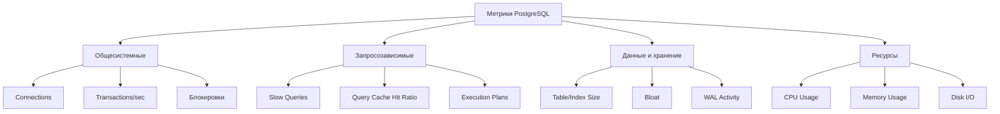

# План мониторинга производительности PostgreSQL

## 1. Обзор системы мониторинга

Эффективный мониторинг производительности PostgreSQL критически важен для стабильной работы системы с размером базы данных ~5.5 ГБ и 74 таблицами, особенно при интенсивных расчетах Бацзы, Цимэнь и других модулей.

### 1.1. Ключевые метрики для мониторинга



## 2. Инструменты мониторинга

### 2.1. Встроенные инструменты PostgreSQL

1. **pg_stat_statements**
   ```sql
   -- Включение расширения
   CREATE EXTENSION IF NOT EXISTS pg_stat_statements;
   
   -- Настройка параметров в postgresql.conf
   -- shared_preload_libraries = 'pg_stat_statements'
   -- pg_stat_statements.track = 'all'
   -- pg_stat_statements.max = 10000
   ```

2. **Системные представления PostgreSQL**
   - `pg_stat_database` - статистика на уровне базы данных
   - `pg_stat_user_tables` - статистика таблиц
   - `pg_stat_user_indexes` - статистика индексов
   - `pg_locks` - активные блокировки

### 2.2. Внешние инструменты

1. **pgAdmin** - для визуализации и анализа статистики
2. **Prometheus + Grafana** - для сбора метрик и создания информативных дашбордов
3. **pg_activity** - интерактивный мониторинг активности в реальном времени
4. **pgBadger** - анализатор логов PostgreSQL

## 3. Скрипты мониторинга производительности

### 3.1. Анализ медленных запросов

```python
# code/utils/pg_perf_monitor.py

import psycopg2
from psycopg2 import sql
from datetime import datetime
import os
import csv

def analyze_slow_queries(min_execution_time=1000, limit=20):
    """
    Анализ медленных запросов с временем выполнения выше порогового значения (в мс)
    
    Args:
        min_execution_time: Минимальное время выполнения запроса в мс
        limit: Максимальное количество запросов для анализа
    
    Returns:
        List[Dict]: Список медленных запросов с их статистикой
    """
    conn = None
    try:
        from code.common.db_config import get_connection
        conn = get_connection()
        cursor = conn.cursor()
        
        query = sql.SQL("""
            SELECT 
                query,
                calls,
                total_time / calls as avg_time,
                total_time,
                rows / calls as avg_rows,
                100.0 * shared_blks_hit / nullif(shared_blks_hit + shared_blks_read, 0) AS hit_ratio
            FROM pg_stat_statements
            WHERE total_time / calls > %s
            ORDER BY total_time / calls DESC
            LIMIT %s
        """)
        
        cursor.execute(query, (min_execution_time, limit))
        columns = [desc[0] for desc in cursor.description]
        results = [dict(zip(columns, row)) for row in cursor.fetchall()]
        
        # Сохранение результатов в CSV
        timestamp = datetime.now().strftime("%Y%m%d_%H%M%S")
        os.makedirs('logs/performance', exist_ok=True)
        csv_path = f'logs/performance/slow_queries_{timestamp}.csv'
        
        with open(csv_path, 'w', newline='') as csvfile:
            writer = csv.DictWriter(csvfile, fieldnames=columns)
            writer.writeheader()
            for row in results:
                writer.writerow(row)
                
        return results
        
    finally:
        if conn:
            conn.close()
```

### 3.2. Анализ размера таблиц и индексов

```python
# code/utils/pg_size_monitor.py

def analyze_table_sizes():
    """
    Анализ размеров таблиц и индексов для выявления проблемных мест
    
    Returns:
        Dict: Статистика по размеру таблиц и индексов
    """
    conn = None
    try:
        from code.common.db_config import get_connection
        conn = get_connection()
        cursor = conn.cursor()
        
        query = """
            SELECT
                schemaname || '.' || tablename AS relation,
                pg_size_pretty(pg_total_relation_size('"' || schemaname || '"."' || tablename || '"')) AS total_size,
                pg_size_pretty(pg_relation_size('"' || schemaname || '"."' || tablename || '"')) AS table_size,
                pg_size_pretty(pg_total_relation_size('"' || schemaname || '"."' || tablename || '"') - 
                               pg_relation_size('"' || schemaname || '"."' || tablename || '"')) AS index_size,
                pg_total_relation_size('"' || schemaname || '"."' || tablename || '"') as size_in_bytes
            FROM pg_tables
            WHERE schemaname NOT IN ('pg_catalog', 'information_schema')
            ORDER BY pg_total_relation_size('"' || schemaname || '"."' || tablename || '"') DESC
        """
        
        cursor.execute(query)
        columns = [desc[0] for desc in cursor.description]
        results = [dict(zip(columns, row)) for row in cursor.fetchall()]
        
        # Сохранение результатов в CSV
        timestamp = datetime.now().strftime("%Y%m%d_%H%M%S")
        os.makedirs('logs/performance', exist_ok=True)
        csv_path = f'logs/performance/table_sizes_{timestamp}.csv'
        
        with open(csv_path, 'w', newline='') as csvfile:
            writer = csv.DictWriter(csvfile, fieldnames=columns)
            writer.writeheader()
            for row in results:
                writer.writerow(row)
                
        return results
        
    finally:
        if conn:
            conn.close()
```

### 3.3. Мониторинг кэш-попаданий

```python
# code/utils/pg_cache_monitor.py

def analyze_cache_hits():
    """
    Анализ эффективности кэширования для таблиц и индексов
    
    Returns:
        Dict: Статистика по эффективности кэширования
    """
    conn = None
    try:
        from code.common.db_config import get_connection
        conn = get_connection()
        cursor = conn.cursor()
        
        query = """
            SELECT
                relname AS table_name,
                heap_blks_read,
                heap_blks_hit,
                CASE WHEN heap_blks_hit + heap_blks_read = 0 THEN 0
                     ELSE 100 * heap_blks_hit / (heap_blks_hit + heap_blks_read)
                END AS heap_hit_ratio,
                idx_blks_read,
                idx_blks_hit,
                CASE WHEN idx_blks_hit + idx_blks_read = 0 THEN 0
                     ELSE 100 * idx_blks_hit / (idx_blks_hit + idx_blks_read)
                END AS idx_hit_ratio
            FROM pg_statio_user_tables
            ORDER BY heap_blks_hit + heap_blks_read + idx_blks_hit + idx_blks_read DESC
            LIMIT 30
        """
        
        cursor.execute(query)
        columns = [desc[0] for desc in cursor.description]
        results = [dict(zip(columns, row)) for row in cursor.fetchall()]
        
        # Сохранение результатов в CSV
        timestamp = datetime.now().strftime("%Y%m%d_%H%M%S")
        os.makedirs('logs/performance', exist_ok=True)
        csv_path = f'logs/performance/cache_hits_{timestamp}.csv'
        
        with open(csv_path, 'w', newline='') as csvfile:
            writer = csv.DictWriter(csvfile, fieldnames=columns)
            writer.writeheader()
            for row in results:
                writer.writerow(row)
                
        return results
        
    finally:
        if conn:
            conn.close()
```

## 4. Автоматизация мониторинга

### 4.1. Скрипт для регулярного запуска мониторинга

```python
# code/utils/run_performance_monitoring.py

import schedule
import time
import os
import logging
from datetime import datetime

from pg_perf_monitor import analyze_slow_queries
from pg_size_monitor import analyze_table_sizes
from pg_cache_monitor import analyze_cache_hits

# Настройка логирования
logging.basicConfig(
    level=logging.INFO,
    format='%(asctime)s - %(name)s - %(levelname)s - %(message)s',
    handlers=[
        logging.FileHandler('logs/performance_monitoring.log'),
        logging.StreamHandler()
    ]
)

logger = logging.getLogger("pg_monitoring")

def run_monitoring():
    """
    Запуск всех мониторинговых скриптов и сохранение результатов
    """
    timestamp = datetime.now().strftime("%Y-%m-%d %H:%M:%S")
    logger.info(f"Начало мониторинга производительности PostgreSQL: {timestamp}")
    
    try:
        # Анализ медленных запросов
        slow_queries = analyze_slow_queries(min_execution_time=500, limit=30)
        logger.info(f"Найдено {len(slow_queries)} медленных запросов")
        
        # Анализ размеров таблиц
        table_sizes = analyze_table_sizes()
        logger.info(f"Проанализированы размеры {len(table_sizes)} таблиц")
        
        # Анализ кэширования
        cache_hits = analyze_cache_hits()
        logger.info(f"Проанализирована статистика кэширования для {len(cache_hits)} таблиц")
        
        # Можно добавить дополнительные проверки и алерты по необходимости
        for query in slow_queries:
            if query['avg_time'] > 5000:  # Более 5 секунд
                logger.warning(f"Критически медленный запрос: {query['query'][:100]}... - {query['avg_time']} мс")
        
        # Проверка bloat для крупных таблиц
        for table in table_sizes[:10]:  # Топ-10 по размеру
            if 'size_in_bytes' in table and table['size_in_bytes'] > 1024 * 1024 * 100:  # > 100 MB
                logger.info(f"Крупная таблица: {table['relation']} - {table['total_size']}")
    
    except Exception as e:
        logger.error(f"Ошибка при мониторинге: {str(e)}")
        
    logger.info(f"Мониторинг завершен: {datetime.now().strftime('%Y-%m-%d %H:%M:%S')}")

# Запуск каждый день в 03:00
schedule.every().day.at("03:00").do(run_monitoring)

# Для отладки - запуск сразу
run_monitoring()

# Основной цикл для работы планировщика
while True:
    schedule.run_pending()
    time.sleep(60)
```

### 4.2. Скрипт автоматического обслуживания

```python
# code/utils/pg_maintenance.py

def run_vacuum(analyze_only=False, tables=None):
    """
    Запуск VACUUM для очистки и анализа таблиц
    
    Args:
        analyze_only: Только анализ без очистки (ANALYZE)
        tables: Список таблиц для обработки, None для всех таблиц
    """
    conn = None
    try:
        from code.common.db_config import get_connection
        conn = get_connection()
        conn.autocommit = True  # Требуется для VACUUM
        cursor = conn.cursor()
        
        if tables is None:
            # Получение всех пользовательских таблиц
            cursor.execute("""
                SELECT schemaname || '.' || tablename 
                FROM pg_tables
                WHERE schemaname NOT IN ('pg_catalog', 'information_schema')
            """)
            tables = [row[0] for row in cursor.fetchall()]
        
        for table in tables:
            try:
                start_time = datetime.now()
                if analyze_only:
                    logger.info(f"Запуск ANALYZE для {table}")
                    cursor.execute(sql.SQL("ANALYZE {}").format(sql.Identifier(table)))
                else:
                    logger.info(f"Запуск VACUUM ANALYZE для {table}")
                    cursor.execute(sql.SQL("VACUUM ANALYZE {}").format(sql.Identifier(table)))
                
                duration = (datetime.now() - start_time).total_seconds()
                logger.info(f"Обработка {table} завершена за {duration} сек.")
            
            except Exception as e:
                logger.error(f"Ошибка при обработке {table}: {str(e)}")
    
    except Exception as e:
        logger.error(f"Ошибка при запуске обслуживания БД: {str(e)}")
    
    finally:
        if conn:
            conn.close()

def reindex_database():
    """
    Перестроение индексов для улучшения производительности
    """
    conn = None
    try:
        from code.common.db_config import get_connection
        conn = get_connection()
        conn.autocommit = True
        cursor = conn.cursor()
        
        # Получение всех индексов
        cursor.execute("""
            SELECT
                schemaname || '.' || indexname AS index_name,
                schemaname || '.' || tablename AS table_name
            FROM pg_indexes
            WHERE schemaname NOT IN ('pg_catalog', 'information_schema')
        """)
        
        indexes = cursor.fetchall()
        for index_name, table_name in indexes:
            try:
                start_time = datetime.now()
                logger.info(f"Перестроение индекса {index_name}")
                cursor.execute(sql.SQL("REINDEX INDEX {}").format(sql.Identifier(index_name)))
                
                duration = (datetime.now() - start_time).total_seconds()
                logger.info(f"Перестроение {index_name} завершено за {duration} сек.")
            
            except Exception as e:
                logger.error(f"Ошибка при перестроении индекса {index_name}: {str(e)}")
    
    except Exception as e:
        logger.error(f"Ошибка при перестроении индексов: {str(e)}")
    
    finally:
        if conn:
            conn.close()
```

## 5. Настройка PostgreSQL

### 5.1. Основные параметры для оптимизации

```
# рекомендуемые параметры для PostgreSQL 16+ (5.5 GB DB)

# Память
shared_buffers = 2GB               # 25% от RAM для выделенного сервера
work_mem = 32MB                    # для сложных запросов
maintenance_work_mem = 256MB       # для операций обслуживания
effective_cache_size = 6GB         # 75% от RAM

# Журналирование
wal_buffers = 16MB                 # 1/32 от shared_buffers
checkpoint_completion_target = 0.9  # растянуть запись чекпоинта
min_wal_size = 1GB
max_wal_size = 4GB

# Планировщик
random_page_cost = 1.1             # для SSD
effective_io_concurrency = 200     # для SSD
default_statistics_target = 100    # для сложных запросов

# Параллелизм
max_worker_processes = 8
max_parallel_workers_per_gather = 4
max_parallel_workers = 8
max_parallel_maintenance_workers = 4

# Статистика и мониторинг
track_activities = on
track_counts = on
track_io_timing = on
track_functions = all
log_min_duration_statement = 1000  # логировать запросы дольше 1000 мс
```

### 5.2. Оптимизации для пакетной обработки

```
# Параметры для пакетных операций (например, расчет календарей)

# Временно увеличиваем во время массовой загрузки
maintenance_work_mem = 1GB
work_mem = 128MB
checkpoint_timeout = 30min
max_wal_size = 8GB

# Настройки для COPY
temp_buffers = 128MB
```

## 6. Регулярные проверки и обслуживание

### 6.1. Еженедельное обслуживание

1. Анализ и очистка таблиц
   ```bash
   # Запуск VACUUM ANALYZE для важных таблиц
   python -m code.utils.pg_maintenance
   ```

2. Проверка фрагментации и bloat
   ```sql
   -- Для анализа bloat можно использовать pg_stats_statements
   SELECT
       schemaname || '.' || relname AS tablename,
       n_dead_tup,
       n_live_tup,
       CASE WHEN n_live_tup = 0 THEN 0 ELSE (n_dead_tup::float / n_live_tup::float) * 100 END AS dead_tup_ratio
   FROM pg_stat_user_tables
   ORDER BY dead_tup_ratio DESC;
   ```

### 6.2. Месячное обслуживание

1. Перестроение индексов
   ```bash
   # Перестроение всех индексов
   python -m code.utils.pg_maintenance reindex_database
   ```

2. Полное обслуживание базы
   ```sql
   VACUUM FULL ANALYZE;  -- Внимание: блокирует таблицы!
   ```

## 7. Контроль производительности для ключевых операций

### 7.1. Мониторинг производительности Rule Engine

Создание декоратора для измерения времени выполнения функций:

```python
# code/common/perf_monitor.py

import time
import functools
import logging
from datetime import datetime

logger = logging.getLogger("performance")

def measure_time(func):
    """
    Декоратор для измерения времени выполнения функций
    """
    @functools.wraps(func)
    def wrapper(*args, **kwargs):
        start_time = time.time()
        result = func(*args, **kwargs)
        end_time = time.time()
        execution_time = end_time - start_time
        
        # Логируем результаты
        logger.info(f"{func.__name__} выполнена за {execution_time:.4f} сек.")
        
        # Для длительных операций записываем в отдельный файл
        if execution_time > 1.0:  # Более 1 секунды
            with open('logs/performance/long_operations.log', 'a') as f:
                timestamp = datetime.now().strftime("%Y-%m-%d %H:%M:%S")
                f.write(f"{timestamp} | {func.__name__} | {execution_time:.4f} сек.\n")
        
        return result
    return wrapper
```

Применение декоратора к ключевым функциям Rule Engine:

```python
# code/analysis/engine.py

from code.common.perf_monitor import measure_time

class RuleEngine:
    # ... существующий код ...
    
    @measure_time
    def analyze_structure(self, structure_id, rules=None):
        """
        Анализ структуры по набору правил
        """
        # ... существующий код ...
        
    @measure_time
    def apply_rule(self, rule_id, data):
        """
        Применение конкретного правила к данным
        """
        # ... существующий код ...
```

## 8. Инструкция по работе с системой мониторинга

### 8.1. Начало работы

1. Установка необходимых пакетов
   ```bash
   pip install schedule psycopg2-binary pandas matplotlib
   ```

2. Настройка базы данных
   ```sql
   CREATE EXTENSION IF NOT EXISTS pg_stat_statements;
   ```

3. Запуск мониторинга на регулярной основе
   ```bash
   # Manual run
   python -m code.utils.run_performance_monitoring
   
   # Регулярный запуск через cron или systemd timer
   ```

### 8.2. Реагирование на проблемы

| Проблема | Метрика | Пороговое значение | Действие |
|----------|---------|-------------------|----------|
| Медленные запросы | avg_time | > 1000 мс | Анализ плана выполнения, оптимизация запроса |
| Низкое кэширование | hit_ratio | < 90% | Увеличение shared_buffers |
| Фрагментация таблиц | dead_tup_ratio | > 20% | VACUUM ANALYZE |
| Большой размер WAL | wal_activity | > 1GB/час | Проверка частоты коммитов |
| Высокая нагрузка CPU | cpu_usage | > 80% | Анализ процессов, оптимизация запросов |

## 9. План реагирования на инциденты

### 9.1. Обнаружение проблемы
1. Автоматический мониторинг выявляет превышение пороговых значений
2. Алерт отправляется в систему оповещения
3. Запуск скриптов диагностики для сбора дополнительной информации

### 9.2. Диагностика и устранение
1. Анализ логов и метрик для определения причины
2. Применение соответствующих мер:
   - Настройка параметров PostgreSQL
   - Оптимизация проблемных запросов
   - Обслуживание проблемных таблиц
   - Перезапуск служб при необходимости

### 9.3. Документирование
1. Запись инцидента в журнал инцидентов
2. Обновление планов мониторинга для предотвращения повторения