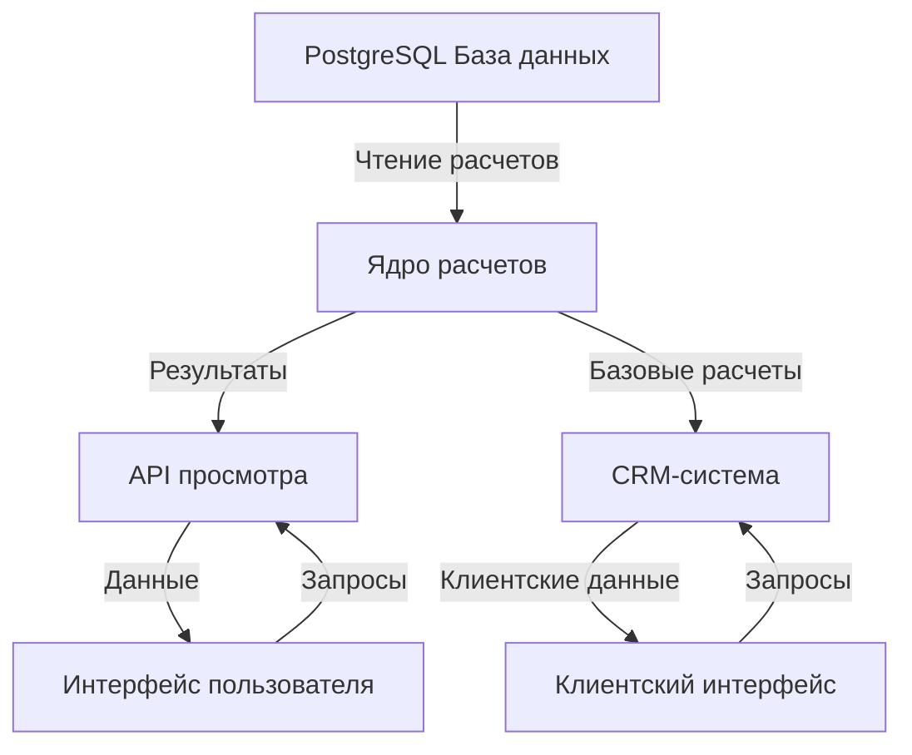
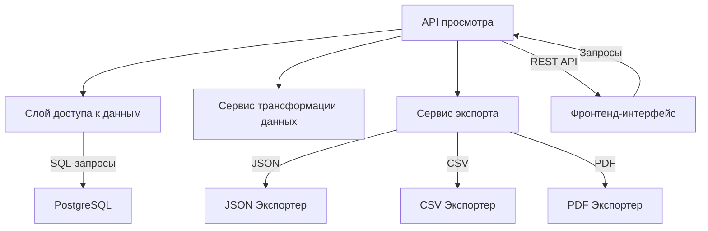
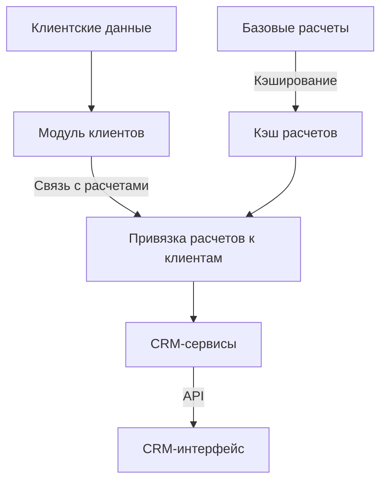
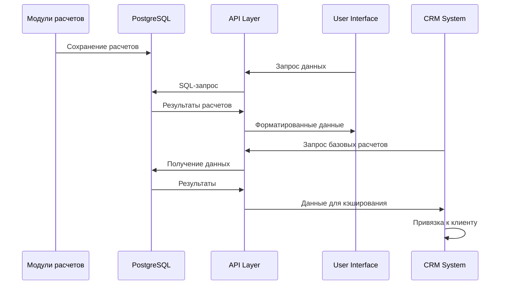

# Архитектура интерфейса и CRM-системы

## 1. Общая архитектура



## 2. Интерфейс просмотра результатов расчетов

### 2.1. Требования к интерфейсу
- Просмотр результатов расчетов Бацзы, Цимэнь, Фэн-шуй и других модулей
- Фильтрация по периодам, типам расчетов, параметрам
- Визуализация данных в удобном формате
- Экспорт данных в различные форматы (JSON, CSV, PDF)
- Интерактивный просмотр связей между элементами расчетов

### 2.2. Архитектура интерфейса



### 2.3. Компоненты API просмотра
- **DataAccessService**: Централизованный доступ к данным в PostgreSQL
- **TransformService**: Преобразование данных из БД в формат для отображения
- **ExportService**: Экспорт данных в различные форматы
- **RESTful API**: Эндпоинты для получения, фильтрации и экспорта данных

### 2.4. Фронтенд-интерфейс
- **Технологии**: Web-интерфейс (рекомендуется React/Vue + TypeScript)
- **Компоненты**:
  - Дашборд с общей статистикой
  - Модуль просмотра Бацзы
  - Модуль просмотра Цимэнь
  - Модуль просмотра Фэн-шуй
  - Страница экспорта данных
  - Фильтры и настройки отображения

## 3. Архитектура CRM-системы

### 3.1. Концепция разделения базовых расчетов и пользовательских данных



### 3.2. Структура базы данных для CRM

```
1. Таблицы клиентов:
   - clients (id, name, email, phone, ...)
   - client_sessions (id, client_id, date, notes, ...)
   - client_preferences (id, client_id, setting_key, setting_value)

2. Таблицы связей:
   - client_calculations (id, client_id, calculation_type, reference_id, created_at)
   - calculation_notes (id, client_calculation_id, note_text, created_at)

3. Таблицы расширений:
   - client_documents (id, client_id, document_type, file_path, created_at)
   - client_reminders (id, client_id, reminder_date, reminder_text, is_completed)
```

### 3.3. Механизм кэширования расчетов
- **Стратегия**: Базовые расчеты выполняются один раз и сохраняются в кэше
- **Реализация**: 
  - Использование дополнительной таблицы `calculation_cache`
  - Хранение ссылок на расчеты в клиентских записях
  - Инкрементальное обновление кэша при изменении алгоритмов

### 3.4. Архитектура API для CRM

```
1. Клиентское API:
   - /api/clients - CRUD операции с клиентами
   - /api/clients/{id}/calculations - Получение расчетов для клиента
   - /api/clients/{id}/notes - Работа с заметками
   - /api/clients/{id}/preferences - Управление настройками

2. Расчетное API:
   - /api/calculations - Доступ к кэшу расчетов
   - /api/calculations/link - Привязка расчетов к клиентам
   - /api/calculations/custom - Кастомизация расчетов для клиента
```

## 4. Интеграция с текущей системой

### 4.1. Принципы интеграции
- Существующие модули калькуляторов остаются неизменными
- Добавляется слой API для доступа к данным
- Разрабатывается отдельный фронтенд для просмотра
- CRM использует существующие расчеты через кэширование

### 4.2. Процесс взаимодействия систем



## 5. План реализации

### 5.1. Этап 1: Разработка API просмотра
- Создание слоя доступа к данным PostgreSQL
- Разработка сервисов трансформации данных
- Реализация базовых API-эндпоинтов
- Тестирование производительности и оптимизация

### 5.2. Этап 2: Разработка интерфейса просмотра
- Разработка базовых компонентов UI
- Реализация модулей просмотра для каждого типа расчетов
- Добавление экспорта данных
- Тестирование пользовательского опыта

### 5.3. Этап 3: Проектирование CRM
- Создание схемы БД для клиентских данных
- Разработка механизма кэширования расчетов
- Реализация API для работы с клиентами
- Тестирование процесса связывания расчетов с клиентами

### 5.4. Этап 4: Реализация CRM-интерфейса
- Разработка UI для работы с клиентами
- Интеграция с API расчетов
- Реализация специфических функций CRM
- Тестирование полного цикла работы

## 6. Технические рекомендации

### 6.1. Для API и серверной части
- Использовать FastAPI для разработки REST API (производительность и автоматическая документация)
- Применять SQLAlchemy для работы с БД через ORM
- Использовать Pydantic для валидации данных
- Реализовать кэширование частых запросов через Redis

### 6.2. Для фронтенд-части
- Использовать React с TypeScript для разработки UI
- Применять Material-UI или Ant Design для базовых компонентов интерфейса
- Использовать библиотеки визуализации данных (D3.js, Chart.js) для отображения расчетов
- Реализовать SSR для улучшения производительности

### 6.3. Для интеграционного слоя
- Использовать единую систему аутентификации
- Реализовать механизм мониторинга производительности
- Разработать систему логирования для отслеживания ошибок
- Использовать контейнеризацию для упрощения развертывания