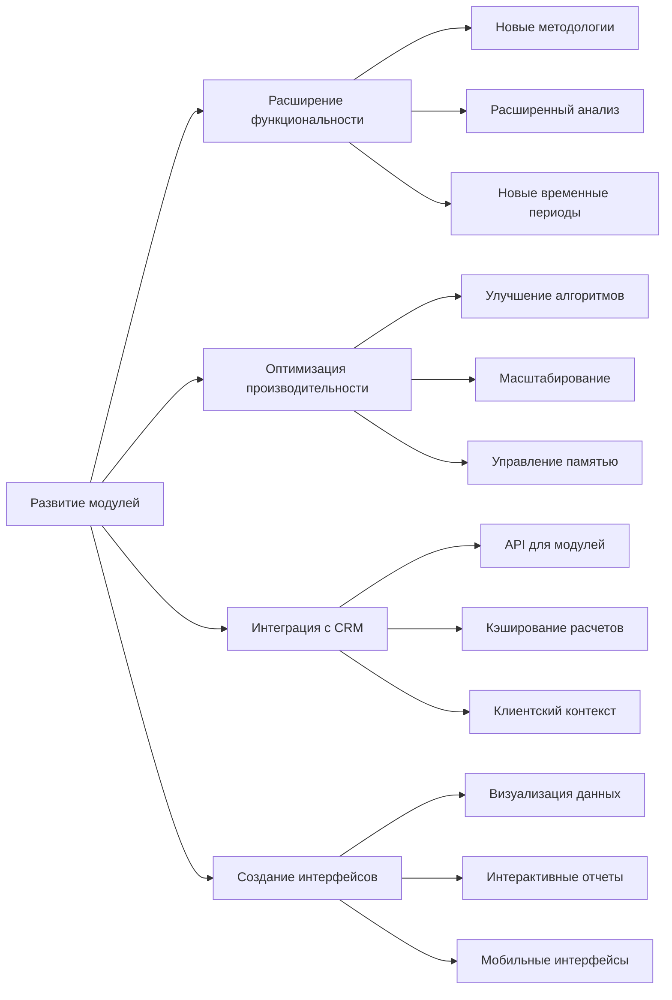

# Дорожная карта развития модулей калькуляторов

## 1. Обзор и текущее состояние

Платформа китайской метафизики (Calk_KMF) в настоящее время находится в стабильном состоянии (версия 2.3) со следующими функциональными модулями:

- **Бацзы календарь**: полная функциональность с расширенными методологиями
- **Ци Мэнь Дунь Цзя**: две системы (Чжи Рэн и Чай Бу) с оптимизированными шаблонами
- **Фэн-шуй**: летящие звезды для периодов (Год, Месяц, День, Час)
- **Rule Engine**: аналитический движок с 100+ правилами

Данный документ определяет стратегию дальнейшего развития модулей на ближайшие 2 года.

## 2. Ключевые направления развития

## 3. Краткосрочные планы (3-6 месяцев)

### 3.1. Бацзы календарь
- **Добавление новых методологий**:
  - Интеграция системы 12 дворцов
  - Расширение функциональности Наинь (Nayin) с дополнительными соответствиями
  - Добавление детальных описаний для 10 богов

- **Оптимизация расчетов**:
  - Реализация дополнительного кэширования для часто используемых комбинаций
  - Создание представлений (views) в PostgreSQL для ускорения аналитических запросов

- **API для Бацзы-календаря**:
  - Разработка RESTful API для доступа к данным календаря
  - Создание структурированных DTO для передачи данных на фронтенд

### 3.2. Ци Мэнь Дунь Цзя
- **Расширение системы шаблонов**:
  - Добавление специализированных шаблонов для редких астрономических событий
  - Реализация дополнительных категорий структур

- **Улучшение системы анализа**:
  - Добавление 20+ новых правил для анализа структур
  - Внедрение степени значимости правил (весовых коэффициентов)

- **Оптимизация обработки**:
  - Переход на регулярные обновления шаблонов (инкрементальная обработка)
  - Улучшение алгоритма поиска по шаблонам

### 3.3. Общая инфраструктура
- **Мониторинг производительности**:
  - Внедрение системы мониторинга PostgreSQL
  - Создание дашбордов для отслеживания производительности

- **API-слой**:
  - Разработка унифицированного API для всех модулей
  - Документирование API с использованием OpenAPI/Swagger

- **Интерфейс просмотра**:
  - Создание базового интерфейса для просмотра расчетов
  - Реализация экспорта данных (JSON, CSV, PDF)

## 4. Среднесрочные планы (6-12 месяцев)

### 4.1. Бацзы календарь
- **Расширенная аналитика**:
  - Внедрение анализа удачи и неудачи по периодам
  - Интеграция системы Циментунцзы (Four Pillars Destiny)
  - Добавление прогнозирования на основе 10-летних столпов

- **Персонализация расчетов**:
  - Система учета индивидуальных особенностей карты
  - Настраиваемые весовые коэффициенты для элементов

- **Интеграция с CRM**:
  - Возможность сохранения интерпретации карты для клиентов
  - Система рекомендаций на основе Бацзы-профиля клиента

### 4.2. Ци Мэнь Дунь Цзя
- **Новые системы расчетов**:
  - Добавление третьей методологии (например, Da Yi school)
  - Реализация расчетов для нестандартных периодов

- **Продвинутая аналитика структур**:
  - Внедрение статистического анализа паттернов
  - Создание системы рекомендаций по выбору дат и активаций

- **Визуализация данных**:
  - Интерактивные карты с послойным отображением информации
  - Динамическая визуализация изменений структур во времени

### 4.3. Фэн-шуй
- **Расширение функциональности**:
  - Добавление расчетов прямоугольной и нерегулярной сетки
  - Интеграция с географическими данными для учета реального ландшафта

- **Трехмерные модели**:
  - Возможность работы с 3D-моделями помещений
  - Расчет энергетических потоков в трехмерном пространстве

- **Персонализация рекомендаций**:
  - Учет индивидуальных Бацзы-карт при формировании рекомендаций
  - Интеграция с CRM для сохранения проектов клиентов

### 4.4. CRM-система
- **Создание базовой CRM**:
  - Разработка модуля управления клиентами
  - Интеграция с калькуляторами через API

- **Механизм кэширования**:
  - Реализация интеллектуального кэширования расчетов для клиентов
  - Система инкрементальных обновлений при изменении алгоритмов

- **Клиентский интерфейс**:
  - Разработка основного пользовательского интерфейса
  - Создание системы отчетов и рекомендаций для клиентов

## 5. Долгосрочные планы (1-2 года)

### 5.1. Интеграция и единая система
- **Унификация алгоритмов**:
  - Создание единой системы интерпретации результатов
  - Кросс-модульный анализ и рекомендации

- **Машинное обучение**:
  - Внедрение алгоритмов ML для прогнозирования и анализа
  - Персонализированные рекомендации на основе истории клиента

- **Облачная версия**:
  - Реализация масштабируемой облачной архитектуры
  - Система подписки и API для сторонних разработчиков

### 5.2. Расширение временного диапазона
- **Исторические данные**:
  - Добавление исторических расчетов (100+ лет назад)
  - Возможность анализа исторических событий

- **Долгосрочные прогнозы**:
  - Расширение горизонта прогнозирования до 10+ лет
  - Система долгосрочного стратегического планирования

### 5.3. Мобильные приложения
- **Нативные мобильные приложения**:
  - Разработка iOS/Android версий для доступа к калькуляторам
  - Интеграция с CRM и системой уведомлений

- **Оффлайн-режим**:
  - Возможность работы без подключения к интернету
  - Синхронизация данных при подключении

### 5.4. Аналитическая платформа
- **Продвинутая аналитика**:
  - Создание комплексной аналитической платформы
  - Сравнительный анализ различных методологий

- **Интерактивное обучение**:
  - Система обучения пользователей китайской метафизике
  - Интерактивные кейсы и примеры

## 6. Технический долг и оптимизации

На всех этапах развития необходимо уделять внимание следующим аспектам:

### 6.1. Оптимизация производительности
- Регулярное профилирование и оптимизация запросов в PostgreSQL
- Мониторинг и оптимизация использования памяти
- Планирование масштабирования для растущей базы данных

### 6.2. Тестирование
- Расширение покрытия регрессионными тестами
- Внедрение автоматизированного тестирования UI
- Создание тестовых сценариев для проверки интеграций

### 6.3. Рефакторинг
- Регулярный аудит кодовой базы для выявления дублирования
- Улучшение структуры и организации модулей
- Обновление документации и комментариев в коде

## 7. Оценка приоритетов

| Функциональность | Приоритет | Сложность | Ценность для пользователей |
|--------------------|-----------|-----------|---------------------------|
| Интерфейс просмотра результатов | Высокий | Средняя | Высокая |
| Базовая CRM-система | Высокий | Высокая | Высокая |
| Расширение анализа Ци Мэнь | Средний | Средняя | Высокая |
| Дополнительные методологии Бацзы | Средний | Средняя | Средняя |
| 3D-модели Фэн-шуй | Низкий | Высокая | Средняя |
| Мобильные приложения | Низкий | Высокая | Высокая |

## 8. Следующие шаги

Для успешного начала реализации дорожной карты необходимо:

1. **Провести технический аудит** текущей кодовой базы и архитектуры
2. **Детализировать первые этапы** разработки интерфейса и CRM-системы
3. **Разработать API-слой** для обеспечения стандартизированного доступа к данным
4. **Внедрить систему мониторинга** для отслеживания производительности
5. **Определить метрики успеха** для оценки прогресса по каждому направлению